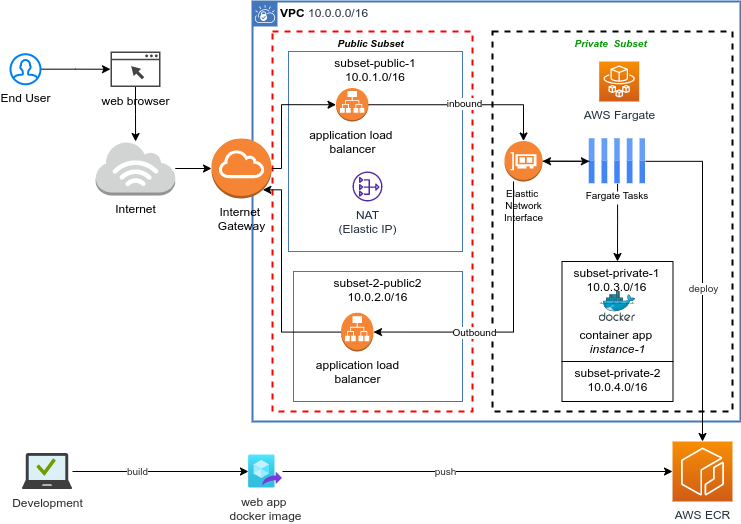

# aws-vpc-container-app

Running secured container app without managing servers (Amazon ECS or EKS) with AWS Fargate.

Architecture:

*Prerequisite:  aws account*

Local setup

> aws-cli
>
> docker
>
> ide

**AWS Cloud Resources**

- ECR / Repository
- Fargate
  - EC2 cluster
  - VCP
  - Task Definitions
  - Services
- Security Group
- Routing Table
- Internet gateway
- NAT gateway
- Load Balancer
- Elastic IP

**AWS Setup**

Step-By-Step @TODO

**Build and Deploy Web App**

1. aws login in to ECR

> $(aws ecr get-login --no-include-email --region ca-central-1)

2. docker login

> docker login -u AWS -p `<token>` <ECR_URL>

3. build, tag and push the docker image

> docker build -t cicdapp:latest .
>
> docker tag cicdapp:latest 054806615651.dkr.ecr.ca-central-1.amazonaws.com/cicdapp:latest
>
> docker push 054806615651.dkr.ecr.ca-central-1.amazonaws.com/cicdapp:latest

> docker tag cicdapp:latest <ECR_URL>/cicdapp:latest

5. push to ECR

> docker push <ECR_URL>/cicdapp:latest

Check Web App Deployment is alive:

*https://myalb-795454577.ca-central-1.elb.amazonaws.com*
